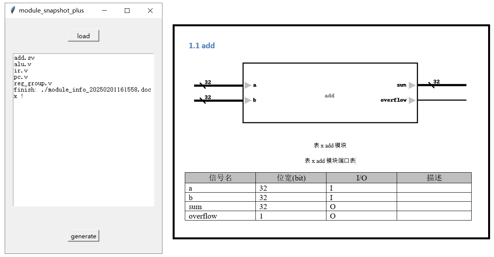

# module_snapshot_plus

## brief

本仓库是在QyLey的仓库https://gitee.com/qyley/module_snapshot上进行修改扩展得到的。

导入verilog/systemverilog文件，绘制模块的端口图和端口信号表，并插入word文件中。

注意点：

- 只支持部分 verilog 2001 语法 。(支持sv的logic关键字)
- 一行最多定义一个IO信号。
- 绘制的模块图不可以修改，若要修改请使用QyLey `module_snapshot/draw.io`

## preview

左侧为程序运行ui截图，load按钮用于加载filelist文件。

右侧为生成的word doc文件截图，上侧为模块端口图，下侧为模块端口信号表。



## usage 

```python
pip install -r requirements.txt
python module_snapshot_plus.py
```


